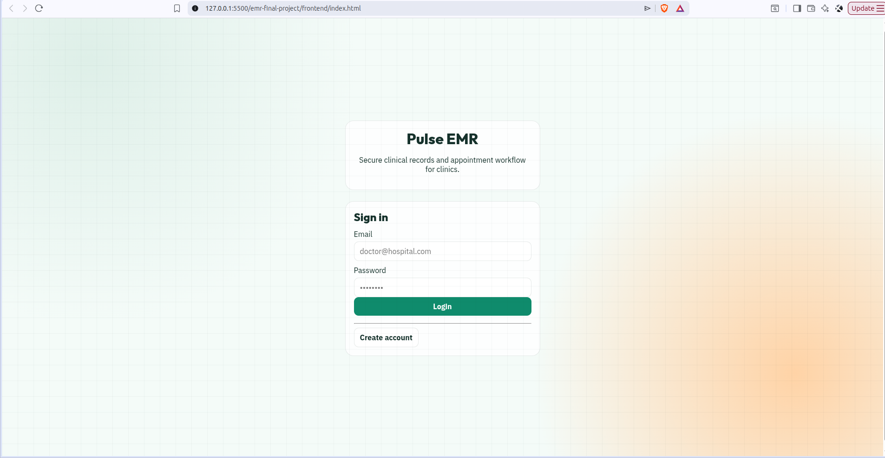
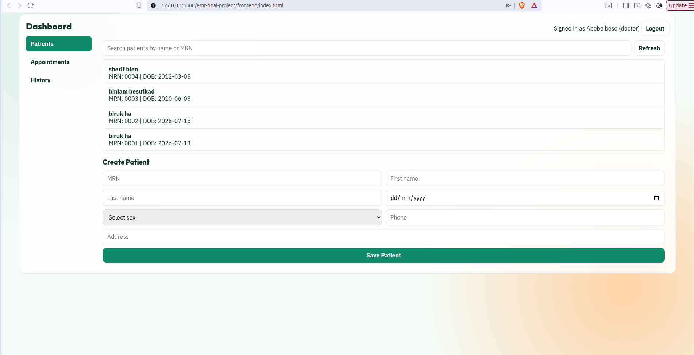

# Pulse EMR

Pulse EMR is a simple Electronic Medical Record (EMR) system. It helps manage patients, appointments, users, and medical records.

## Technologies Used

- Node.js
- Express.js
- PostgreSQL
- HTML, CSS, JavaScript
- JWT Authentication
- bcrypt

## Project Structure

```
emr-final-project/
│
├── backend/
├── frontend/
├── database/
├── docs/
└── README.md
```

## Installation

1. Create the database:

```sql
CREATE DATABASE emr_db;
```

2. Import the database schema:

```bash
psql -U postgres -d emr_db -f database/schema.sql
```

3. Install backend dependencies:

```bash
cd backend
npm install
```

4. Create a `.env` file and update your database settings.

5. Start the server:

```bash
npm run dev
```

6. Open `frontend/index.html` using Live Server.

## Features

- User Login and Registration
- JWT Authentication
- Patient Management
- Appointment Management
- Role-based Access
- PostgreSQL Database

## API Endpoints

- POST `/api/auth/register`
- POST `/api/auth/login`
- GET `/api/patients`
- POST `/api/patients`
- GET `/api/appointments`
- POST `/api/appointments`

## Screenshots

### Login Page



### Dashboard


